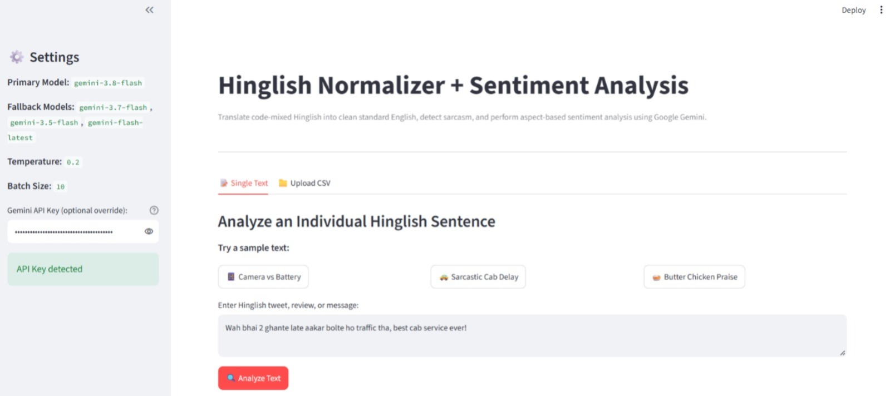
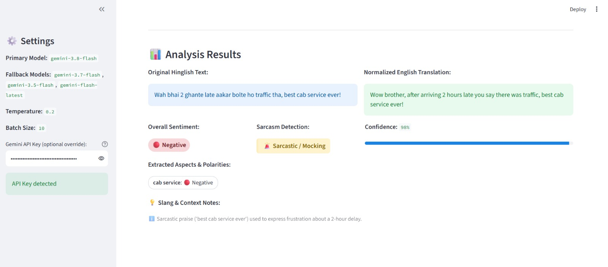
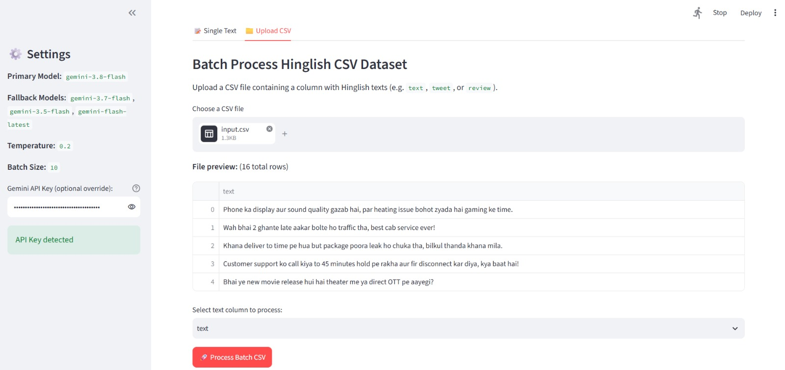
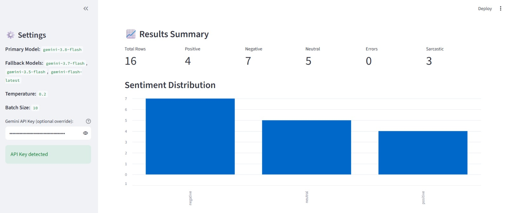
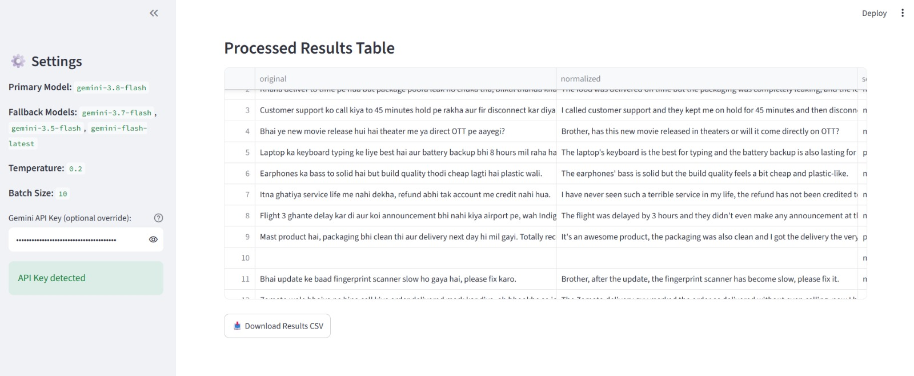

# Hinglish Normalizer + Sentiment Analysis

An NLP pipeline and Streamlit web app, built with Python and the Google Gemini API, that takes **Hinglish** (Hindi-English code-mixed) tweets and reviews, converts them into clean standard English, and extracts sentiment, sarcasm, and aspect-level insights.

> Example: `yaar ye phone bakwaas hai` → *"Man, this phone is rubbish."* → **negative**





## Why this project?

Hinglish is how many Indians write online, but standard sentiment tools struggle with it: Romanized Hindi has no fixed spelling, words like *kal* and *bas* are ambiguous, and sarcasm ("wah bhai, best service ever" after a 2-hour delay) flips the meaning. This project uses an LLM to handle all of these in a single structured call.

## Features

| Feature | What it does |
|---|---|
| Normalization / translation | Converts colloquial Hinglish into fluent standard English |
| Sentiment classification | `positive`, `negative` or `neutral` |
| Sarcasm detection | `true` / `false` flag for irony or mockery |
| Aspect-based sentiment | Extracts aspects (camera, battery, delivery, price...) with a sentiment each |
| Confidence score | A value from 0.0 to 1.0 per row |
| Colloquial notes | Explains slang or ambiguous words |
| Batch + UI | Command-line CSV pipeline and a Streamlit app |

## Project Structure

```
Hinglish-Sentiment/
├── config.yaml          # Model, fallback models, temperature, batch size, paths
├── processor.py         # Core engine: API calls, retries, validation, batch processing
├── main.py              # CLI entry point (input CSV -> output CSV)
├── app.py               # Streamlit web UI
├── requirements.txt     # Python dependencies
├── .env.example         # Template for the API key
├── .gitignore           # Ignores .env, __pycache__, output/
├── README.md
│
├── prompts/
│   └── normalize.txt    # Prompt template (rules, JSON schema, few-shot examples)
│
├── data/
│   └── input.csv        # Sample input texts
│
├── eval/
│   ├── test_set.csv     # Hand-labeled test sentences (sentiment + sarcasm)
│   └── evaluate.py      # Computes sentiment and sarcasm accuracy
│
└── docs/images/         # Screenshots used in this README
```

`output/results.csv` is generated when you run the pipeline (it is not stored in the repo).

## Requirements

- Python 3.10 or newer
- A free Gemini API key from [Google AI Studio](https://aistudio.google.com)
- Internet connection (texts are sent to the Gemini API for processing)

## Setup

**1. Clone the repository**

```bash
git clone https://github.com/akshita-guptaa/Hinglish-Sentiment.git
cd Hinglish-Sentiment
```

**2. Create and activate a virtual environment (recommended)**

Windows (PowerShell):
```powershell
python -m venv .venv
.venv\Scripts\Activate.ps1
```

macOS / Linux:
```bash
python3 -m venv .venv
source .venv/bin/activate
```

**3. Install dependencies**

```bash
pip install -r requirements.txt
```

**4. Add your API key**

Copy the template to a new `.env` file.

Windows (PowerShell):
```powershell
Copy-Item .env.example .env
```

macOS / Linux:
```bash
cp .env.example .env
```

Open `.env` and replace the placeholder with your key:

```
GEMINI_API_KEY="your_gemini_api_key_here"
```

> **Important:** never commit your `.env` file. It is listed in `.gitignore`, so your key stays on your machine.

## Usage

### Option 1: Streamlit web app

```bash
python -m streamlit run app.py
```

The app opens in your browser with two tabs:

- **Single text:** type Hinglish text or click a sample button, then click **Analyze Text**. You get the original and normalized text side by side, a color-coded sentiment badge, a sarcasm indicator, a confidence bar, aspect tags, and slang notes.
- **Upload CSV:** upload a CSV with a text column. A progress bar shows batch progress, followed by summary counts, a sentiment distribution chart, and a button to download the results as CSV.








### Option 2: Command line

```bash
python main.py
```

Reads `data/input.csv` in batches, calls Gemini, validates each response, and writes `output/results.csv`.

## Configuration

All settings live in `config.yaml`, so you can change behavior without editing code:

```yaml
model_name: "gemini-3.8-flash"
fallback_models:
  - "gemini-3.7-flash"
  - "gemini-3.5-flash"
  - "gemini-flash-latest"
temperature: 0.2
batch_size: 10
retry_limit: 1
input_path: "data/input.csv"
output_path: "output/results.csv"
prompt_path: "prompts/normalize.txt"
```

| Setting | Meaning |
|---|---|
| `model_name` | Primary Gemini model |
| `fallback_models` | Models tried in order if the primary one is unavailable |
| `temperature` | Low value keeps labels and JSON output consistent |
| `batch_size` | Number of texts sent per API call |
| `retry_limit` | Retries when a response is not valid JSON |

## Output Schema

| Column | Description | Example |
|---|---|---|
| `original` | Raw Hinglish text | `Wah bhai 2 ghante late aakar...` |
| `normalized` | Fluent English version | `Wow, arriving 2 hours late and blaming traffic, best cab service ever!` |
| `sentiment` | `positive`, `negative`, `neutral`, or `ERROR` | `negative` |
| `sarcasm` | Sarcasm flag | `True` |
| `aspects` | List of aspects and their sentiment | `[{"aspect": "punctuality", "sentiment": "negative"}]` |
| `confidence` | Model confidence, 0.0 to 1.0 | `0.95` |
| `notes` | Slang or nuance explanation | `Sarcastic praise used to express frustration` |

`ERROR` marks rows where the API failed. These rows are excluded from charts and accuracy counts, so they never appear as fake results.

## Prompt Design

The prompt lives in `prompts/normalize.txt`, separate from the code, so it can be improved without touching the pipeline. It contains:

- **Role and task:** an expert in Hinglish normalization and aspect-based sentiment.
- **Strict JSON schema:** `id`, `normalized`, `sentiment`, `sarcasm`, `aspects`, `confidence` and `notes`, which the code validates after every call.
- **Explicit rules:**
  - Handles Roman script, Devanagari, and mixed script.
  - Sarcasm: the sentiment follows what the writer actually means, not the literal praise.
  - Mixed opinions give an overall `neutral` with each aspect listed separately.
  - Questions and plain facts are `neutral`.
  - Ambiguous words (*kal*, *bas*, *sahi*, *ghanta*) are resolved from context and explained in `notes`.
  - Confidence is calibrated: high only when the meaning is clear, lower for short or ambiguous texts.
  - No invented aspects.
- **Few-shot examples:** six examples covering mixed sentiment, sarcasm, a bug report, a neutral question, slang praise, and a very short ambiguous text with low confidence.
- **Batch placeholder:** each batch of texts is inserted into `{batch_json}`, so the instructions are sent once per batch instead of once per text.

## How It Works

1. `main.py` / `app.py` load `config.yaml` and the prompt file.
2. Texts are grouped into batches (default 10 per call), which cuts the number of API requests and the total latency.
3. `processor.py` sends each batch to Gemini and requests JSON output.
4. The response is parsed and validated (field types, allowed sentiment values, confidence range, correct row count). Invalid JSON responses are retried.
5. On temporary errors (503 or 429), the pipeline retries with exponential backoff (2s, 4s, 8s, 16s), then moves to the next model in `fallback_models`.
6. Results are written to CSV or shown in the UI.

**Design decisions**

- **Shared engine:** both the CLI and the UI import from `processor.py`, so there is no duplicated logic.
- **No fake results:** if every retry and fallback fails, the UI shows "The AI service is busy, please try again in a minute", and CSV rows are marked `ERROR`.
- **Config-driven:** model, batch size, paths and temperature are set in one file.
- **Secrets safety:** the API key is read from `.env` and never stored in the code.

## Evaluation

A hand-labeled test set of 55 Hinglish sentences is in `eval/test_set.csv`, with the expected sentiment and sarcasm label for each. It covers positive, negative and neutral texts, 12 sarcastic sentences, mixed opinions, questions, very short texts, emojis and SMS-style spelling, and Devanagari script. The test sentences are written separately from the few-shot examples in the prompt, so the score is not inflated by memorized examples.

To reproduce the results:

```bash
python eval/evaluate.py
```

| Metric | Result |
|---|---|
| Test sentences | 55 |
| Sentiment accuracy | 100% (55/55) |
| Sarcasm accuracy | 98.2% (54/55) |

The script also prints a confusion table and the list of mismatches, and saves every prediction to `eval/eval_results.csv`. The only mismatch was *"Ghanta acha hai ye phone"*: the sentiment (negative) was correct, but the model flagged the slang negation as sarcasm, which is a debatable edge case. All 12 sarcastic sentences were caught.

## Troubleshooting

| Problem | Fix |
|---|---|
| `streamlit` is not recognized | Run `python -m streamlit run app.py` |
| API key error | Check that `.env` exists, is saved, and has no extra spaces around `=` |
| "AI service is busy" | Wait a minute and retry; the app already retries and switches to fallback models |
| `ModuleNotFoundError` | Run `pip install -r requirements.txt` again inside your virtual environment |

## Limitations

- LLM output can be wrong on rare slang, regional dialects, or very short sarcastic texts.
- Free-tier API limits can slow down large CSV files.
- The test set is small (55 sentences), so accuracy numbers are indicative, not definitive.
- Texts are sent to the Google Gemini API, so do not process private or sensitive data.

## Future Work

- Support more code-mixed languages and regional dialects
- Cache results to avoid re-processing repeated texts
- Larger evaluation set and per-aspect accuracy
